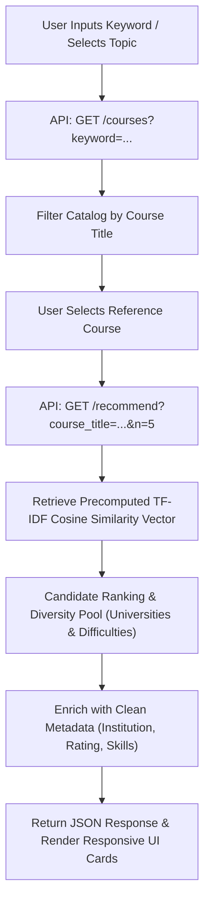

<div align="center">
  <h1>Course Recommendation System</h1>
  <p><strong>Intelligent Content-Based Course Discovery Engine Powered by NLP & Machine Learning</strong></p>
</div>

<p align="center">
    
    
    
    
    
    
    
    
    
    
</p>

This Python Flask web application delivers personalized course recommendations across a curated catalog of **3,424+ online courses**. It leverages Natural Language Processing (**TF-IDF Vectorization** and **Cosine Similarity**) coupled with **diversity-aware candidate selection** to guide students and professionals toward tailored educational pathways.

---

## Table of Contents
- [Key Features](#key-features)
- [Dataset & Data Source](#dataset--data-source)
- [Recommendation Engine Pipeline](#recommendation-engine-pipeline)
- [Project Structure](#project-structure)
- [Test Suite Matrix](#test-suite-matrix)
- [Setup & Installation](#setup--installation)
- [Running the Application](#running-the-application)
- [Executing Tests](#executing-tests)
- [API Reference](#api-reference)
- [Troubleshooting & FAQ](#troubleshooting--faq)
- [License](#license)

---

## Key Features

- **Personalized Course Recommendations**: Generates tailored course suggestions based on textual similarity across thousands of course descriptions using TF-IDF vectorization and cosine similarity.
- **Diversity-Aware Candidate Selection**: Balances similarity scores with institutional and difficulty diversity to avoid redundant recommendations from the same university or skill level.
- **Interactive Catalog Search**: Enables users to search a catalog of 3,400+ online courses by keyword or subject with real-time autocomplete suggestions and live course counters.
- **Quick-Topic Exploration**: Provides one-click discovery for popular domains including Python, Data Science, Machine Learning, Web Development, Artificial Intelligence, and Cloud Computing.
- **Comprehensive Course Profiles**: Displays essential course information including offering university/partner, difficulty tier, learner rating, technical skills taught, and expandable course syllabus descriptions.
- **Direct Course Enrollment Access**: Features verified direct links to original Coursera course pages for streamlined access and enrollment.
- **Customizable Recommendation Count**: Allows users to specify how many recommendations to generate, toggling between Top 3, 5, 8, or 10 courses.
- **RESTful API Backend**: Exposes dedicated endpoints (`/courses`, `/recommend`, `/api/health`) for programmatic access, enabling seamless integration with external clients or frontends.

---

## Dataset & Data Source

The recommendation engine is built on the **Coursera Course Dataset**, publicly available on Kaggle:

- **Source Platform**: [Kaggle - Coursera Course Dataset](https://www.kaggle.com/datasets/siddharthm1698/coursera-course-dataset)
- **Author / Publisher**: [Siddharth M](https://www.kaggle.com/siddharthm1698)
- **Dataset Size**: 3,424 cleaned and structured course records
- **Format**: CSV stored at [`data/cleaned_dataset.csv`](data/cleaned_dataset.csv)
- **Included Features**:
  | Column Name | Description | Example |
  | :--- | :--- | :--- |
  | `Course Name` | Full title of the course on Coursera | *Python For Everybody* |
  | `University` | Partner university or organization offering the course | *University of Michigan* |
  | `Difficulty Level` | Course target level (`Beginner`, `Intermediate`, `Advanced`, `Conversant`) | *Beginner* |
  | `Course Rating` | Average user rating on Coursera (scale 1.0 - 5.0) | `4.8` |
  | `Course URL` | Direct URL to access course materials on Coursera | `https://www.coursera.org/learn/...` |
  | `Course Description` | Text description covering syllabus, topics, and objectives | *Learn fundamental syntax...* |
  | `Skills` | Technical domain competencies and tags | *Python, JSON, Data Structures* |

---

## Recommendation Engine Pipeline



### How the Model Works
1. **TF-IDF Vectorization**: Course descriptions are processed with n-gram ranges (1, 2) and English stop words filtered to capture technical concepts and domain terms.
2. **Cosine Similarity**: Measures the angular distance between course vectors, capturing nuanced conceptual relevance.
3. **Diversity-Aware Selection**: Balances high similarity with variety across different institutions and difficulty tiers to avoid repetitive recommendations.

---

## Project Structure

```
Course-Recommendation-System/
├── app.py                          # Flask application, routing & recommendation service
├── model.py                        # Training & serialization script
├── requirements.txt                # Production Python dependencies
├── requirements-dev.txt            # Development & testing dependencies (pytest, pytest-cov)
├── pytest.ini                      # Pytest runner configuration
├── package.json                    # Node.js configuration & test scripts
├── playwright.config.js            # Playwright E2E configuration & webServer setup
├── data/
│   └── cleaned_dataset.csv         # Raw catalog dataset (3,424 Coursera courses)
├── models/
│   ├── cosine_sim.pkl              # Precomputed pairwise cosine similarity matrix
│   ├── df.pkl                      # Serialized course DataFrame
│   ├── tfidf_vectorizer.pkl        # Fitted TF-IDF vectorizer
│   ├── svd_model.pkl               # Collaborative filtering SVD model
│   └── knn_model.pkl               # Collaborative filtering KNN model
├── static/
│   ├── css/styles.css              # Modern stylesheet with variables, badges & animations
│   └── js/scripts.js               # Client-side debounce, API calls, and card rendering
├── templates/
│   └── index.html                  # Modern Bootstrap 5.3 HTML5 template
└── tests/
    ├── unit/
    │   └── test_recommendation_logic.py # Algorithmic & logic unit tests (12 tests)
    ├── integration/
    │   └── test_api_routes.py           # Flask API client integration tests (11 tests)
    └── e2e/
        └── course-recommendation.spec.js # Playwright E2E browser test suite (8 scenarios)
```

---

## Test Suite Matrix

| Suite | Category | Runner & Language | File | Tests | Coverage Scope |
| :--- | :--- | :--- | :--- | :---: | :--- |
| **Logic Unit Tests** | Backend Logic | `pytest` (Python) | [`tests/unit/test_recommendation_logic.py`](tests/unit/test_recommendation_logic.py) | **12** | Ranking accuracy, self-exclusion, schema validity, title casing, boundary handling, mock pipeline, keyword matching |
| **Integration Tests** | API Routes | `pytest` (Python) | [`tests/integration/test_api_routes.py`](tests/integration/test_api_routes.py) | **11** | Status codes (200, 400, 404), schema verification, param parsing (`n`), query validation, `/api/health` |
| **Playwright E2E** | Full Browser | Playwright (JavaScript) | [`tests/e2e/course-recommendation.spec.js`](tests/e2e/course-recommendation.spec.js) | **8** | Initial UI render, debounced autocomplete, topic pills, card generation, count change, form clear, empty validation, mobile layout |
| **TOTAL** | | | | **31** | **Full end-to-end coverage** |

---

## Setup & Installation

### 1. Prerequisites
- **Python 3.10+** (Tested on Python 3.12)
- **Node.js 18+** & **npm**

### 2. Clone the Repository
```bash
git clone https://github.com/saboye/Course-Recommendation-System.git
cd Course-Recommendation-System
```

### 3. Set Up Python Virtual Environment
```bash
# Create virtual environment
python -m venv venv

# Activate on Windows:
venv\Scripts\activate

# Activate on macOS / Linux:
source venv/bin/activate

# Install application and testing dependencies:
pip install -r requirements.txt
pip install -r requirements-dev.txt
```

### 4. Install Node.js & Playwright Dependencies
```bash
npm install
npx playwright install chromium
```

---

## Running the Application

1. **Start the Flask server**:
   ```bash
   python app.py
   ```
2. **Access the application**:
   Open your browser and navigate to:
   ```
   http://127.0.0.1:5000/
   ```

---

## Executing Tests

### Run All Python Tests (Unit & Integration)
```bash
pytest
```

### Run Logic Unit Tests Only
```bash
pytest tests/unit
```

### Run API Integration Tests Only
```bash
pytest tests/integration
```

### Run Python Tests with Code Coverage Report
```bash
pytest --cov=app tests/
```

### Run Playwright End-to-End Tests (JavaScript)
```bash
# Run headless browser tests
npm test

# Run in headed (visible) browser mode:
npm run test:e2e:headed

# Open interactive Playwright UI Runner:
npm run test:e2e:ui
```

---

## API Reference

### 1. `GET /api/health`
Health check and system status.
- **Example Request**:
  ```bash
  curl http://127.0.0.1:5000/api/health
  ```
- **Example Response** (`200 OK`):
  ```json
  {
    "has_models": true,
    "status": "healthy",
    "total_courses": 3424
  }
  ```

---

### 2. `GET /courses`
Search the course catalog by keyword.
- **Parameters**: `keyword` (string, required)
- **Example Request**:
  ```bash
  curl "http://127.0.0.1:5000/courses?keyword=Python"
  ```
- **Example Response** (`200 OK`):
  ```json
  {
    "count": 48,
    "courses": [
      "Python For Everybody",
      "Applied Data Science With Python",
      "Crash Course On Python"
    ]
  }
  ```

---

### 3. `GET /recommend`
Get content-based course recommendations based on a reference course.
- **Parameters**:
  - `course_title` (string, required): Title of reference course.
  - `n` (integer, optional, default: `5`, range: `1-20`): Number of recommendations to return.
- **Example Request**:
  ```bash
  curl "http://127.0.0.1:5000/recommend?course_title=Python%20For%20Everybody&n=3"
  ```
- **Example Response** (`200 OK`):
  ```json
  {
    "count": 3,
    "query": "Python For Everybody",
    "selected_course": {
      "Course Name": "Python For Everybody",
      "University": "University Of Michigan",
      "Difficulty Level": "Beginner",
      "Course Rating": 4.8
    },
    "recommendations": [
      {
        "Course Name": "Python Data Structures",
        "University": "University Of Michigan",
        "Difficulty Level": "Beginner",
        "Course Rating": 4.9,
        "Course URL": "https://www.coursera.org/learn/python-data",
        "Course Description": "This course will introduce the core data structures of the Python programming language...",
        "Skills": "python programming tuples python dictionaries json"
      }
    ]
  }
  ```

---

## Troubleshooting & FAQ

<details>
<summary><strong>1. PowerShell script execution disabled error when activating venv</strong></summary>

If you receive an execution policy error in Windows PowerShell, run:
```powershell
Set-ExecutionPolicy -ExecutionPolicy RemoteSigned -Scope Process
venv\Scripts\activate
```
</details>

<details>
<summary><strong>2. Playwright cannot find browser executable</strong></summary>

Install the browser binaries using:
```bash
npx playwright install chromium
```
</details>

<details>
<summary><strong>3. Port 5000 is already in use</strong></summary>

If port 5000 is occupied, you can stop the conflicting process or change the port in `app.py` and `playwright.config.js`:
```python
app.run(host='127.0.0.1', port=5001, debug=True)
```
</details>

---

## License

This project is licensed under the MIT License - see the [LICENSE](LICENSE) file for details.
